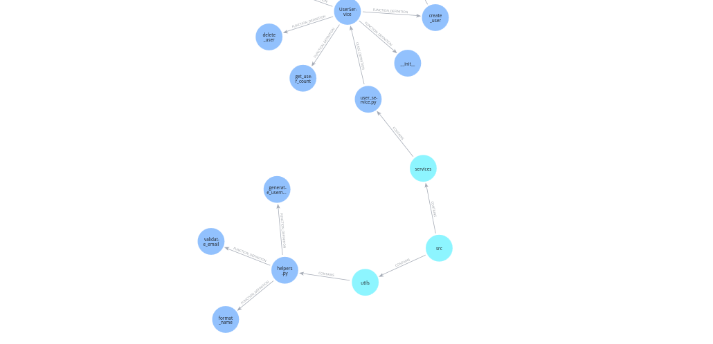

Visual Examples
===============

This section showcases what the generated graphs look like when visualized in Neo4j Browser, demonstrating the output of the core Blarify components.

ProjectGraphCreator Output
--------------------------

The **ProjectGraphCreator** generates comprehensive graphs showing the complete structure and relationships of your codebase.

**Complete Project Graph:**

**Detailed View - Code Relationships:**

.. image:: _static/images/graph_zoomed_in.png
   :alt: Zoomed in view showing detailed relationships between code elements
   :width: 100%
   :align: center

**Relationship Types:**

- **CONTAINS** - Folders contain files
- **DEFINES** - Files define classes and functions, classes define functions
- **CALLS** - Functions calling other functions
- **IMPORTS** - Classes or functions importing from other files

ProjectGraphDiffCreator Output
------------------------------

The **ProjectGraphDiffCreator** creates parallel structures when functions are modified, showing both old and new versions connected by MODIFIED relationships.

**Graph Diff Example:**

This example shows how a modified function creates a parallel file structure with a MODIFIED relationship connecting the old and new versions of the function.

**Complete Graph Diff Output:**

This visualization shows the complete output of GraphDiffCreator. It returns not only the changed nodes but also all parent nodes (file, folder hierarchy) needed to maintain the graph structure. 

**Merge Logic:**

The GraphDiffCreator output is designed to be merged into existing graphs efficiently:

- **Unchanged parent nodes** (folders, files, unchanged functions) have identical paths to the original graph
- **Changed nodes** get new paths and additional relationships (like MODIFIED connections)
- **Database merge operations** can use the paths as unique identifiers to either update existing nodes or create new ones
- **Only truly changed content** creates new graph elements, while the hierarchy structure is preserved

This approach allows incremental graph updates where you can merge the diff output into your existing graph database without duplicating unchanged content.

**Graph Updates vs Pull Request Analysis:**

GraphDiffCreator is used for both pull request analysis and graph updates with one difference:

- **Pull Request analysis**: Changed nodes get new paths to preserve old and new versions
- **Graph updates**: Changed nodes use same paths as original, requiring deletion of existing nodes first

The GraphUpdater class provides a simplified interface for updates - it treats all files as ADDED and uses the same environment for both graph and PR contexts.
